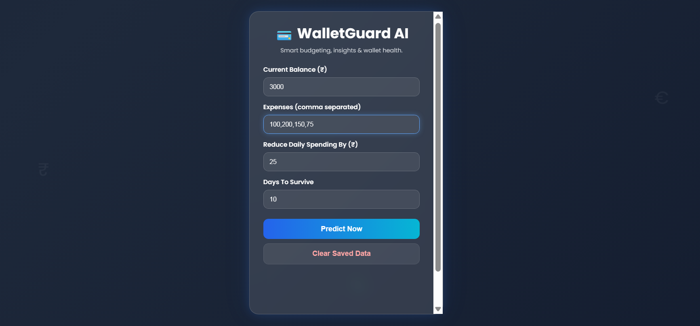
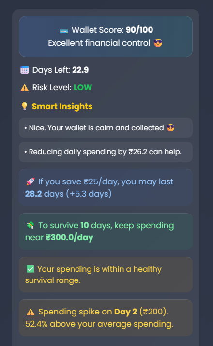
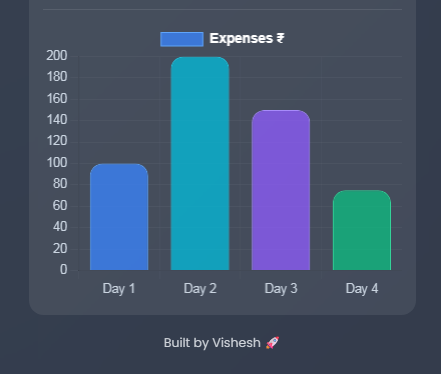
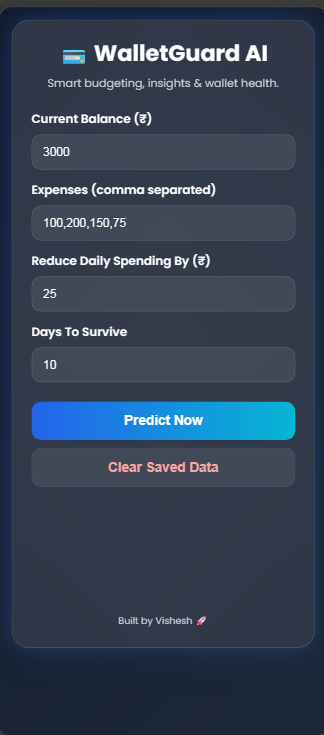

# 💳 WalletGuard AI

<p align="center">
Smart AI-powered personal finance assistant for budgeting, spending control, and wallet health analytics.
</p>

<p align="center">
🚀 Live Demo • 📊 Analytics • 💡 Smart Insights • 🌍 Deployed Full Stack
</p>

---

## 🌐 Live Links

| Platform | Link |
|---|---|
| 🚀 Frontend |https://expense-crash-predictor.vercel.app/|
| ⚙️ Backend API Docs | https://expense-backend-anh3.onrender.com/docs |
| 💻 Repository |https://github.com/visheshdebugger/Expense-Crash-Predictor.git|

---

## 📌 Overview

WalletGuard AI helps users understand **how long their money can last**, detect risky spending habits, simulate better decisions, and improve financial discipline through real-time scoring and insights.

---

## ✨ Core Features

### 💸 Budget Runway Prediction
Estimate how many days current balance may survive.

### 🚨 Risk Level Detection
Low / Medium / High spending risk alerts.

### 💡 Smart Insights Engine
Readable recommendations based on spending behavior.

### 🚀 What-If Simulator
Test how saving ₹X/day changes financial runway.

### 📅 Survival Planner
Know safe daily budget for target survival days.

### ⚠️ Overspending Detector
Compare spending pace against safe limits.

### 📈 Spending Spike Detector
Detect unusually high spending days.

### 💳 Wallet Score Dashboard
Single score summarizing wallet health.

### 💾 Data Memory
Auto-saves previous inputs using local storage.

### 📊 Expense Charts
Visualize spending trends instantly.

---

## 🛠 Tech Stack

| Layer | Technology |
|---|---|
| Frontend | HTML, CSS, JavaScript |
| Charts | Chart.js |
| Backend | Python, FastAPI |
| Server | Uvicorn |
| Hosting | Vercel + Render |
| Version Control | Git + GitHub |

---
## 📸 Screenshots

### Dashboard


### Wallet Score


### Analytics Chart


### Mobile View


---
## 📂 Structure

```bash
backend/
 ├── main.py
 ├── logic.py
 └── requirements.txt

frontend/
 └── index.html
